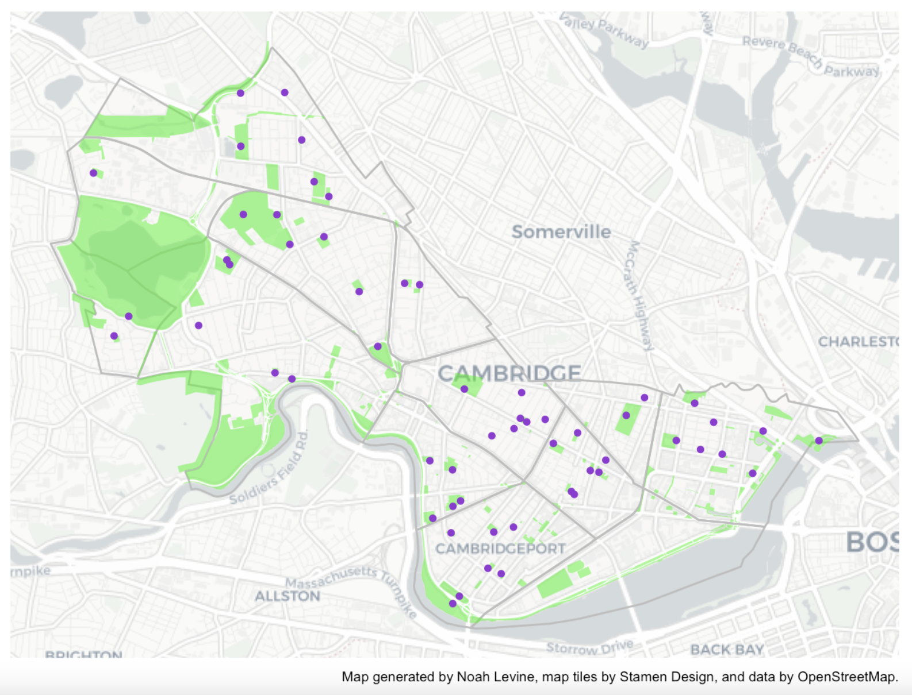
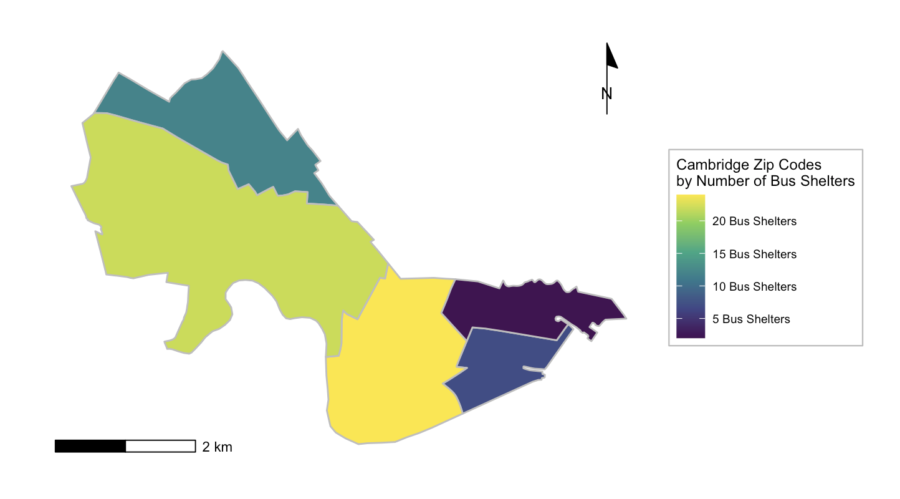
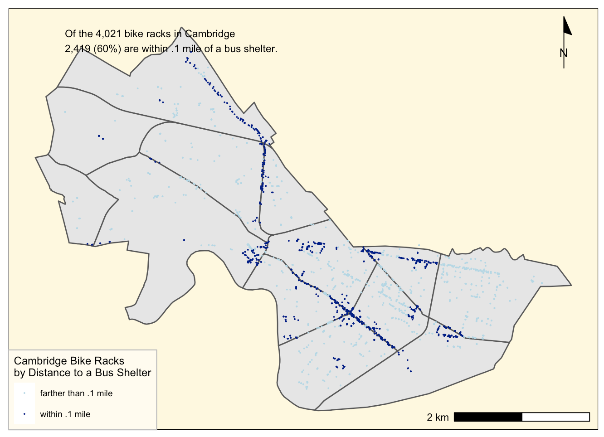
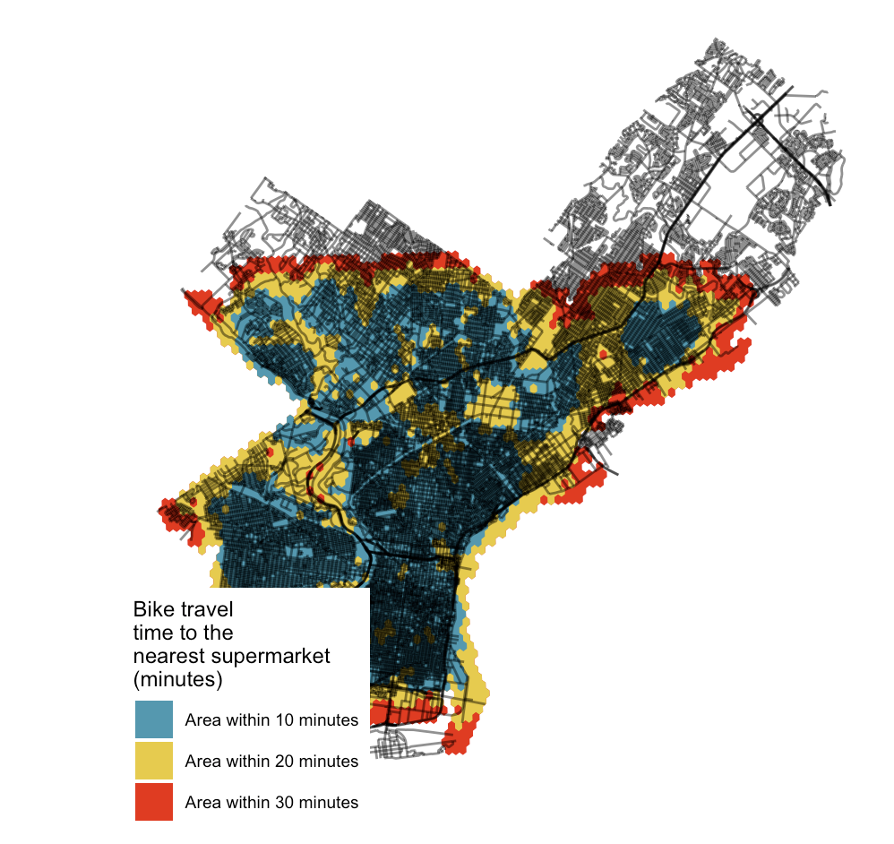
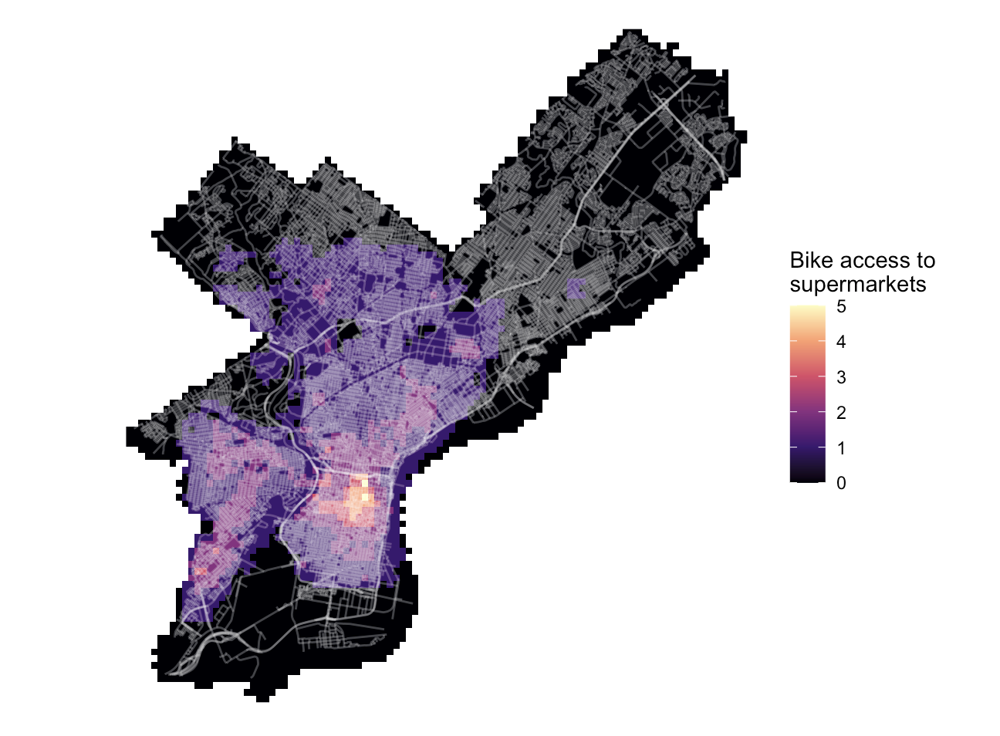
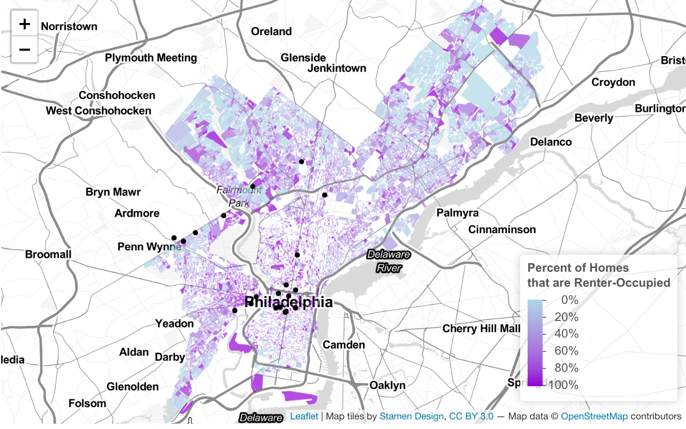
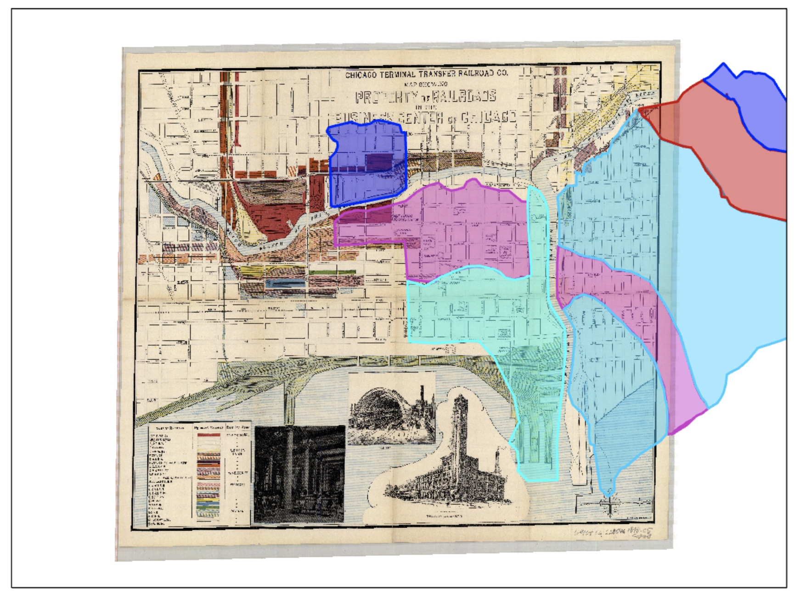

```{r setup, include=FALSE}
knitr::opts_chunk$set(echo = TRUE)
```

# Introduction

This portfolio features maps that I created in 2021 for the course Spatial Analysis (VIS 2128), taught by Dr. Carole Voulgaris. VIS 2128 is a required course for the Master in Urban Planning (MUP) at the Harvard Graduate School of Design (GSD).

Taken together, the maps in this portfolio demonstrate the following eight skills:

1.  Displaying multiple vector layers on the same map
2.  Calculating and displaying relationships among point and polygon layers based on distance
3.  Aggregating point data to a layer of polygons
4.  Calculating and displaying accessibility, based on travel time
5.  Converting between raster layers and vector layers
6.  Displaying raster data on a map
7.  Georeferencing a raster image
8.  Displaying data on an interactive map

While this portfolio features examples of my own work or work to which I made a substantial contribution, I have credited my respective group mates as each map was born of collective brainstorming and troubleshooting.

# Maps of Cambridge

Here are three maps of Cambridge, MA, the home of Harvard University and the city where I currently live.

## Parks & Playgrounds

This map of Cambridge displays the distribution of parks throughout the city as well as the relationship between the city's parks and playgrounds. It has three vector layers: two polygon layers (neighborhoods and parks) and one point layer (playgrounds).



It demonstrates the following skill:

1\. Displaying multiple vector layers on the same map

Group Mates: Marina Freitas, Alex Cardelle, Livesey Pack

## Multimodal Transportation

These two maps of Cambridge respond to the following question: How feasible is multimodal transportation in Cambridge? For the purpose of this assignment, we conceptualized multimodal in terms of bike and bus travel. That is, being able to bike to a bus shelter with a bike rack in its immediate vicinity (0.1 miles). Accordingly, we sourced point data for Cambridge's thousands of bike racks and dozens of bus shelters as well as polygon data for its 13 neighborhoods and five zip codes.





They demonstrate the following skills:

2\. Calculating and displaying relationships among point and polygon layers based on distance

3\. Aggregating point data to a layer of polygons

Group Mates: Lindsey Mayer, Le Yang, Femi Olamijulo

# Maps of Philadelphia

Here are three maps of Philadelphia, the city in which I have the most lived experience, having lived there for three years (Center City and East Passyunk) and grown up in the western suburbs (Devon).

## Food Access

Nuancing the concept of the food desert, we analyzed access to healthy food (i.e. supermarkets) in Philadelphia by mode of transportation: walking, biking, driving, and taking transit.





They demonstrate the following skills:

4\. Calculating and displaying accessibility, based on travel time

5\. Converting between raster layers and vector layers

6\. Displaying raster data on a map

Group Mates: Livesey Pack, Wladka Kijewska

## Renter-Occupied Housing [Interactive Map]

This interactive map of Philadelphia depicts the percentage of renter-occupied homes per 2010 census block in relation to institutions of higher education. My hypothesis was that the share of renter-occupied housing would be higher around colleges and universities, in light of the transient student population. While this holds true for West Philadelphia (University of Pennsylvania and Drexel University), it doesn't hold true for North Philadelphia (Temple University). It demonstrates the following skill:

[](https://noahlevine16.github.io/portfolio/maps/interactive.html)

It demonstrates the following skill:

8\. Displaying data on an interactive map

# Map of Chicago

Here is a historic map of Chicago, a city I visited while driving home from college in Los Angeles. The 1898 map---"Chicago Terminal Transfer Railroad Company Map Showing Property of Railroads in the Business Center of Chicago"---emphasizes the property owned by railroad companies in the city's "business center." In addition to the correspondence of historic railroads with present-day transit lines, we were interested in understanding the impact of the Great Fire of 1871 on the city's development (super-imposed). We learned that the fire directly shaped Chicago's lakefront, with ash and rubble from the fire used as land fill in Lake Michigan (i.e. Grant Park).



It demonstrates the following skill:

7\. Georeferencing a raster image

Group Mates: Anusha Chitturi, Emily Johansen, Samantha Page
